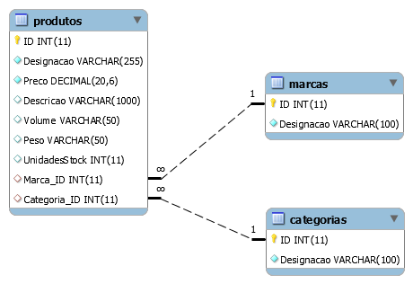

# Acesso Programático a Bases de Dados: MySQL/MariaDB e C#

Conjunto de projetos na linguagem C# que demonstram como utilizar uma base de dados MySQL/MariaDB.

Os projetos demonstram diferentes conceitos e técnicas para atingir este objetivo.

## Descrição

É fornecida uma solução com vários projetos, os quais demonstram vários conceitos:
- **ProjetoConsola**: demonstra como num projeto de consola, efetuar a ligação à base de dados e mostrar dados de uma tabela simples
- **WindowsForms1**: obter dados de uma tabela simples e colocar os dados em 3 controlos diferentes (ListBox, ListView e ComboBox)
- **WindowsForms2**: obter dados de uma tabela mais complexa (tabela ```Produtos```) e popular vários controlos com os dados dados obtidos

## Base de dados utilizada

Os projetos utilizam a base de dados ```hipermercadogirassol```:



Para poder utilizar a base de dados:
- crie uma nova base de dados chamada ```hipermercadogirassol```
- utilize o ficheiro <a href="sql/hipermercado-girassol-lite.sql">sql/hipermercado-girassol-lite.sql</a> para criar as tabelas e inserir dados nas mesmas 

## Requisitos
Os vários projetos da solução utilizam a .NET Framework 4.7.2, mas no Visual Studio este requisito pode ser modificado através das propriedades de cada projeto (menu **Project** &gt; opção **Properties** &gt; separador **Application** &gt; opção **Target framework**)

Importante: este projeto utiliza o software <a href="https://dev.mysql.com/doc/connector-net/en/connector-net-installation.html">MySQL Connector/NET</a>